  

  
  
  
  
  
  

---

<h3><code>mrpandeyshubham@github ~ $ ./contributions.sh</code></h3>

Rendered from my real public contribution calendar — no token, no third-party stats service (see note at the bottom)

  

<h3><code>mrpandeyshubham@github ~ $ whoami</code></h3>
<table>
  <tr>
    <td valign="top"></td>
    <td valign="top"></td>
  </tr>
</table>

---

## 👨‍💻 About Me

- 🎓 Final-year **B.Tech in Computer Science & Engineering**, Parul University (2023 – 2027)
- 💻 Building scalable, production-grade apps with **Java, JavaScript, and the MERN stack**
- ☁️ Hands-on with **AI & Cloud** — IBM Watsonx.ai, Granite LLM, RAG pipelines, IBM Cloud, Google Cloud
- 🧠 **292 problems solved** (LeetCode, CodeChef, GfG & HackerRank) · 1781 LeetCode rating · 1337 CodeChef rating · 33 contests
- 🔥 22-day current streak, 50-day best streak, 151 active days on Codolio
- 🎯 Currently seeking a **Software Engineer** role at a product-based company

---

## 🛠️ Tech Stack

  

  

**Cloud & DevOps:** IBM Cloud · Google Cloud · Vercel · Docker · GitHub Actions
**Core Concepts:** DSA · OOP · System Design · Software Engineering

---

## 🚀 Featured Projects

<table>
<tr>
<td width="50%">

#### 💳 UniBill — GST Billing, POS & Inventory ERP
Full-stack ERP with automated CGST/SGST/IGST tax computation, JWT role-based auth, Zod-validated REST APIs, PDF invoicing via Puppeteer, and a Recharts analytics dashboard. Dockerized with CI/CD via GitHub Actions.

**Stack:** React · Node.js · Express · MongoDB · Docker
  

</td>
<td width="50%">

#### 🩺 CuraBot AI — Healthcare Chatbot
Multilingual medical triage chatbot serving verified healthcare info from trusted Indian government sources. 🏆 Recognized at Vadodara Hackathon 6.0.

**Stack:** Gemini API · n8n · JavaScript
  

</td>
</tr>
<tr>
<td width="50%">

#### 💰 BachatPay — AI Finance Assistant
AI-driven multilingual finance assistant built during the IBM SkillsBuild internship. Integrated RBI/NPCI/SEBI datasets, deployed on IBM Cloud with RAG pipelines.

**Stack:** IBM Watsonx.ai · Granite LLM · RAG
  

</td>
<td width="50%">

#### 🎓 Student Management Dashboard
Add, edit, delete & search student records with localStorage-based persistence.

**Stack:** HTML · CSS · JavaScript
  
 

</td>
</tr>
</table>

> Explore more → [**All Repositories**](https://github.com/mrpandeyshubham?tab=repositories)

---

## 📊 GitHub Analytics

  
  

  

---

## 📜 Licenses & Certifications

- AI Fundamentals with IBM SkillsBuild — Cisco (Sep 2025)
- Web Development using React.js — Parul University (Jul–Sep 2025)
- Java Technology Stack — Infosys Springboard

---

## 🏆 Achievements & Activity

- **LeetCode:** 1781 rating · 24 contests — **CodeChef:** 1337 rating (peak 1345) · 9 contests
- **292 problems solved** across LeetCode, CodeChef, GfG & HackerRank — 151 active days, 22-day streak (50-day best) via [Codolio](https://codolio.com/profile/ShubhamPandey)
- 🏅 Vadodara Hackathon 6.0 (2025) — Built CuraBot AI healthcare chatbot
- 🏅 Build With India Hackathon (2025) & Hack The Mountains 5.0 (2024) — AI-based prototypes for social impact
- 🌍 Active open-source contributor with projects deployed on IBM Cloud and Vercel

---

## 🌐 Connect With Me

  
  
  
  
  

---

## 💡 Quote

> "Success doesn't come from what you do occasionally, it comes from what you do consistently."

---

⭐️ From [Shubham Kumar Pandey](https://github.com/mrpandeyshubham)

<!--
NOTE on the two custom SVGs above (contrib-heatmap.svg, skp-ascii.svg, info-card.svg):
They're generated from real data (your public GitHub contribution calendar, no token needed)
by the Python scripts in /scripts. To keep the heatmap live, add scripts/, data/, and the
GitHub Actions workflow from update-profile-art.yml to this repo — see the setup notes shared
alongside this file for the one-time commands.
-->
