  

  
  
  
  
  

---

I build full-stack, production-grade apps with the **MERN stack**, and I've been getting hands-on with **AI + Cloud** (IBM Watsonx.ai, RAG pipelines) through a recent internship. Final-year CSE student, actively looking for an **SDE role**.

**Currently:** building UniBill, a GST billing & inventory ERP · **Previously:** CuraBot AI, a healthcare triage chatbot

---

<h3><code>mrpandeyshubham@github ~ $ whoami</code></h3>
<table>
  <tr>
    <td valign="top"></td>
    <td valign="top"></td>
  </tr>
</table>

---

## 🛠️ Tech Stack

  

  

**Cloud & DevOps:** IBM Cloud · Google Cloud · Vercel · Docker · GitHub Actions

---

## 🚀 Featured Projects

<table>
<tr>
<td width="50%">

#### 💳 UniBill — GST Billing, POS & Inventory ERP
Full-stack ERP with automated CGST/SGST/IGST tax computation, JWT role-based auth, Zod-validated REST APIs, PDF invoicing via Puppeteer, and a Recharts analytics dashboard. Dockerized with CI/CD via GitHub Actions.

**Stack:** React · Node.js · Express · MongoDB · Docker
  

</td>
<td width="50%">

#### 🩺 CuraBot AI — Healthcare Chatbot
Multilingual medical triage chatbot serving verified healthcare info from trusted Indian government sources. 🏆 Recognized at Vadodara Hackathon 6.0.

**Stack:** Gemini API · n8n · JavaScript
  

</td>
</tr>
<tr>
<td width="50%">

#### 💰 BachatPay — AI Finance Assistant
AI-driven multilingual finance assistant built during the IBM SkillsBuild internship. Integrated RBI/NPCI/SEBI datasets, deployed on IBM Cloud with RAG pipelines.

**Stack:** IBM Watsonx.ai · Granite LLM · RAG
  

</td>
<td width="50%">

#### 🎓 Student Management Dashboard
Add, edit, delete & search student records with localStorage-based persistence.

**Stack:** HTML · CSS · JavaScript
  
 

</td>
</tr>
</table>

> Explore more → [**All Repositories**](https://github.com/mrpandeyshubham?tab=repositories)

---

## 📊 GitHub Analytics

 Self-hosted card, refreshed daily by GitHub Actions — no third-party stats service (see note below)

---

## 📜 Licenses & Certifications

- AI Fundamentals with IBM SkillsBuild — Cisco (Sep 2025)
- Web Development using React.js — Parul University (Jul–Sep 2025)
- Java Technology Stack — Infosys Springboard

---

## 🏆 Achievements

- **LeetCode:** 1781 rating · 24 contests — **CodeChef:** 1337 rating (peak 1345) · 9 contests
- **292 problems solved** across LeetCode, CodeChef, GfG & HackerRank — via [Codolio](https://codolio.com/profile/ShubhamPandey)
- 🏅 Vadodara Hackathon 6.0 (2025) — Built CuraBot AI healthcare chatbot
- 🏅 Build With India Hackathon (2025) & Hack The Mountains 5.0 (2024) — AI-based prototypes for social impact

---

## 🌐 Connect

  
  
  
  
  

<!--
This README uses only two kinds of images:
 1. Self-hosted SVGs (header-banner, footer-banner, stats-card, info-card, skp-ascii) —
    generated by the scripts in /scripts and committed to this repo, so they never
    depend on someone else's server being up. stats-card.svg and info-card.svg are
    refreshed daily by .github/workflows/update-profile-art.yml using live data
    (GitHub API, LeetCode, CodeChef).
 2. shields.io / skillicons.dev / readme-typing-svg badges, chosen because they're
    widely used, well-funded services (unlike the shared free github-readme-stats.vercel.app
    instance, which is currently unreliable/rate-limited for everyone using it).
-->
